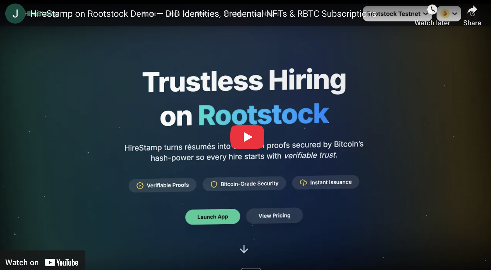

# HireStamp — AI-Assisted Talent Verification on Rootstock

_Verifiable Credentials, deterministic DIDs and on-chain subscription billing secured by Bitcoin’s hash-power through the Rootstock side-chain._

[](https://youtu.be/f11PnUgLKno)

---

## ✨ Why HireStamp?

- **did:rsk identities** — every Team and Issuer mints a deterministic `did:rsk:0x…` via `DIDRegistry.createDID()`; those DIDs become the subject for all future credentials.
- **Credential NFTs** — hashed Verifiable Credentials are anchored as ERC-721 tokens through `CredentialNFT.mintCredential()`, giving recruiters and candidates an immutable audit trail.
- **SubscriptionManager** — Base / Plus plans are paid natively in RBTC; the UI converts amounts to USD in real-time and disables checkout if the quote is older than one hour.
- **Everything in one monorepo** — Next .js 14 App Router frontend, Drizzle-powered PostgreSQL backend and a fully-scripted Hardhat workspace under `/blockchain`.

---

## 🚀 Quick Start

1.  **Clone & install**

    ```
    git clone https://github.com/syntaxsurge/hirestamp-rootstock.git
    cd hirestamp-rootstock
    pnpm install
    ```

2.  **Environment files**

    ```
    cp .env.example .env
    cp blockchain/.env.example blockchain/.env
    ```

    Populate at minimum:

    - `POSTGRES_URL`
    - contract addresses fetched after deployment (see next step)
    - `RSK_TESTNET_RPC_URL` or `RSK_MAINNET_RPC_URL`

3.  **Deploy smart contracts**

    The Solidity layer lives in `/blockchain`. Follow the detailed instructions in `blockchain/README.md` to compile, test and deploy on Rootstock.

4.  **Database setup (optional Docker helper)**

    ```
    docker compose up -d database     # boots Postgres 16 on :54322
    pnpm db:reset                     # runs migrations & seeds demo data
    ```

5.  **Launch HireStamp**

    ```
    pnpm dev
    ```

    Open [http://localhost:3000](http://localhost:3000) and connect a Rootstock-enabled wallet.

---

## 🖥 User-Journey Snapshot

### Candidate

- Wallet-first onboarding, mandatory DID mint.
- Upload credentials → UNVERIFIED · PENDING · VERIFIED/REJECTED lifecycle.
- AI-graded skill-checks; passing score triggers on-chain anchor.

### Issuer

- Self-service onboarding; admin approval required.
- Approve / Reject verification requests — approval signs and mints the Credential NFT.

### Recruiter

- Full-text talent search with verified-only toggle.
- Kanban pipelines, AI fit-summaries cached per recruiter × candidate.

### Admin

- Issuer approvals, role upgrades, credential revocation.
- Platform DID rotation and plan price updates (RBTC wei).

---

## 🧑‍💻 Architecture at a Glance

- **Frontend**: Next .js 14 (App Router), React Server / Client Components.
- **Backend**: PostgreSQL via Drizzle ORM, Edge-runtime middleware, server actions.
- **Smart Contracts**: see `blockchain/README.md`.

---

## 🧠 AI Usage and Prompts

### How AI Tools Were Used

HireStamp integrates OpenAI GPT-4o in three independent workflows:

| Feature                                                                                                              | File(s) / Entry Point                                                                                                                                       | Model Interaction                                                              | Guard-rails & Caching                                                                                                                                                                          |
| -------------------------------------------------------------------------------------------------------------------- | ----------------------------------------------------------------------------------------------------------------------------------------------------------- | ------------------------------------------------------------------------------ | ---------------------------------------------------------------------------------------------------------------------------------------------------------------------------------------------- |
| **Strict Quiz Grader** – grades free-text answers and converts them to a 0-100 score used by candidate Skill Passes. | `lib/ai/openai.ts ➜ openAIAssess()`<br/>`lib/ai/prompts.ts ➜ strictGraderMessages()`<br/>`lib/ai/validators.ts ➜ validateQuizScoreResponse()`               | Non-streaming chat completion with automatic validation & up to **3 retries**. | Centralised validator guarantees a 0-100 integer and `chatCompletion()` automatically retries three times before throwing.                                                                     |
| **Candidate Profile Summary** – produces a 120-word third-person bio shown on public profiles.                       | `lib/ai/openai.ts ➜ summariseCandidateProfile()`<br/>`lib/ai/prompts.ts ➜ summariseProfileMessages()`                                                       | Single-shot chat completion.                                                   | SHA-256 hash of bio + credential list prevents duplicate generations; server limits to **2 runs per UTC day**.                                                                                 |
| **“Why Hire” Fit Summary** – recruiter-specific JSON (five 12-word bullets, bestPipeline, pros/cons).                | `lib/ai/openai.ts ➜ generateCandidateFitSummary()`<br/>`lib/ai/prompts.ts ➜ candidateFitMessages()`<br/>`lib/ai/validators.ts ➜ validateCandidateFitJson()` | Non-streaming chat completion with automatic validation & up to **3 retries**. | Centralised validator auto-parses JSON, enforces schema, and `chatCompletion()` retries three times before error; results cached per recruiter × candidate (`recruiter_candidate_fits` table). |

### AI Prompt & Usage Summary

#### Exact Prompts

<pre>
— Strict Grader (system) —
You are a strict exam grader. Respond ONLY with an integer 0-100.

— Strict Grader (user) —
Quiz topic: {{quizTitle}}
Candidate answer: {{answer}}
Grade (0-100):

— Profile Summary (system) —
Summarise the following candidate profile in approximately {{words}} words. Write in third-person professional tone without using personal pronouns.

— Profile Summary (user) —
{{rawCandidateProfile}}

— Recruiter Fit (system) —
You are an elite technical recruiter assistant with deep knowledge of skill
match-making, talent branding and concise executive communication.  Follow ALL rules
strictly:
• Think step-by-step but output *only* the final JSON (no markdown, no commentary).
• Each "bullets" item MUST contain exactly 12 words; start with an action verb.
• Use the recruiter’s pipelines to choose "bestPipeline"; if none fit, return "NONE".
• Focus on evidence from credentials/bio; do not invent facts.
• Obey the output schema below verbatim.

— Recruiter Fit (user) —
=== Recruiter Pipelines (max 20) ===
{{numberedPipelineList}}

=== Candidate Profile ===
{{candidateProfile}}

Return the JSON now:
</pre>

#### Iterative Prompt Improvements

- **Strict Grader** – started as an open-ended “grade the answer” prompt; tightened to a _single-integer_ response after early experiments returned explanations.
- **Profile Summary** – word-budget parameter lowered from 150 → 120 and switched to third-person to avoid “I have…” phrasing.
- **Fit Summary** – several iterations added: JSON schema surfaced inside the system message, 12-word bullet constraint, and a validation-with-retry loop to guarantee compliant output.

## Final Output

| Item                       | Location                                                                                                                                                                        |
| -------------------------- | ------------------------------------------------------------------------------------------------------------------------------------------------------------------------------- |
| Live Demo                  | https://hirestamp.com                                                                                                                                                           |
| Demo Video                 | https://hirestamp.com/demo-video                                                                                                                                                |
| Demo Video (Mirror)        | https://youtu.be/f11PnUgLKno                                                                                                                                                    |
| Presentation Deck          | https://hirestamp.com/pitch-deck                                                                                                                                                |
| Presentation Deck (Mirror) | https://www.canva.com/design/DAGmXhyuvZA/FkR_sRHov5MhExPDpH6jRg/view?utm_content=DAGmXhyuvZA&utm_campaign=designshare&utm_medium=link2&utm_source=uniquelinks&utlId=h3945d3e964 |

---

## 🙋 Need Help?

Open an issue or start a discussion on GitHub — feedback and PRs are welcome.
